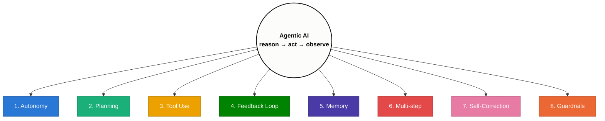
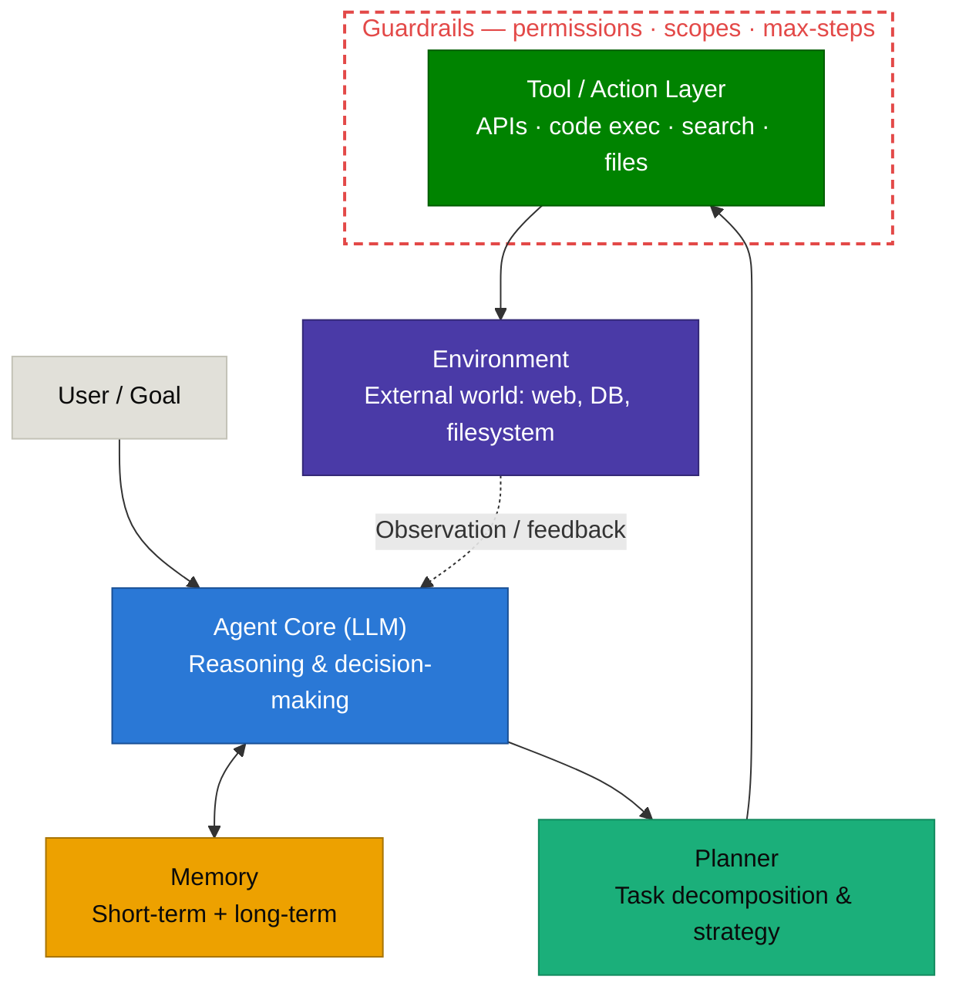

# Agentic AI

---

## What Makes AI "Agentic"

An agent is an LLM wrapped in a loop that lets it act, observe results, and decide its own next step toward a goal — rather than producing one response and stopping.

## Key Characteristics

1. **Autonomy** — it decides *what to do next*, not just what to say. Given a goal, it chooses actions without a human specifying each step.
2. **Goal-directed planning** — it decomposes a high-level objective into sub-tasks, often re-planning as it learns new information (vs. a single-shot prompt→response).
3. **Tool use / action-taking** — it can act on the world (call APIs, run code, browse, write files), not just generate text. This is what turns "answering" into "doing."
4. **Observation & feedback loop** — after acting, it reads the result back into context and adjusts (the core of ReAct: Reason → Act → Observe, repeated).
5. **Persistent state / memory** — it tracks progress across many steps (sometimes minutes to hours), which requires managing what stays in context vs. gets summarized or discarded.
6. **Iterative, multi-step execution** — unlike a chatbot turn, an agentic task can run dozens of steps before producing a final result.
7. **Self-correction** — it can notice a failed action or wrong turn and recover (retry, backtrack, ask for help) rather than failing silently.
8. **Bounded but real autonomy** — it typically operates within guardrails (permissions, tool scopes, max-steps) since full unconstrained autonomy is a reliability and safety risk.

---

## Agent vs. Chatbot vs. Plain LLM Call

| | Plain LLM call | Chatbot | Agent |
|---|---|---|---|
| Turns | One prompt → one response | Multi-turn conversation | Multi-step task execution |
| Acts on the world? | No | No (usually) | Yes — tools, APIs, code |
| Decides next step? | No (human decides) | Partially (human drives) | Yes — model drives |
| Has memory of its own actions? | No | Conversation history only | Tracks actions + observations |
| Stops when? | After one response | After one reply | When goal is met or max steps hit |

---

## Key Components of an Agentic AI System

- **Agent Core (LLM)** — the reasoning engine. Interprets the goal, consults memory, and decides the next action.
- **Planner** — breaks the goal into sub-tasks and orders them; re-plans when a step fails or new information arrives.
- **Memory** — short-term (current context/scratchpad) and long-term (vector store, files, past runs) that the core reads from and writes to.
- **Tool / Action Layer** — the interface to the outside world: API calls, code execution, search, file I/O (this is what MCP standardizes).
- **Environment** — whatever the tools actually touch: a filesystem, a database, a web page, another service.
- **Guardrails** — permissions, tool scopes, and max-step limits that bound what the core is allowed to do — wraps the action layer, not just a policy on paper.
- **Observation / feedback loop** (dashed) — the result of every action flows back into the core's context, closing the Reason → Act → Observe cycle.

## Next Sections to Write
- [ ] The Agent Loop (ReAct: Reason → Act → Observe) — deep dive
- [ ] Tool Use / Function Calling — how models call tools, schemas, error handling
- [ ] Memory & Context Management — short-term vs long-term, summarization, forgetting
- [ ] Planning strategies — ReAct vs. plan-and-execute vs. tree-of-thought
- [ ] Multi-Agent Orchestration — orchestrator + sub-agents, when to delegate
- [ ] MCP (Model Context Protocol) — agent-to-tool standard
- [ ] A2A (Agent-to-Agent Protocol) — agent-to-agent standard
- [ ] Failure modes — infinite loops, tool misuse, hallucinated actions, guardrails
- [ ] Evaluating agents — success criteria beyond single-turn accuracy
