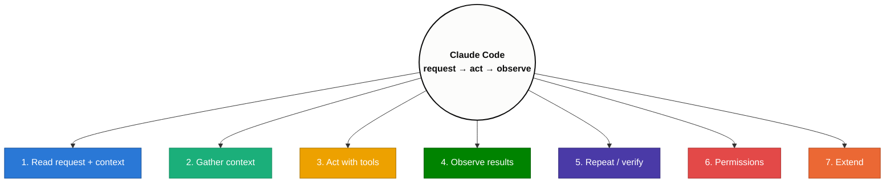

# Claude Code

---

## What is Claude Code

Claude Code is an **agentic coding tool** that runs in your terminal (also available as IDE extensions for VS Code / JetBrains, a desktop app, and on the web). It is powered by Claude and works *inside your actual repository* — it can read and edit files, run shell commands, search code, and use git, then observe the results and decide its next step toward your goal.

It is different from a chatbot in one key way: a chatbot *answers*, an agent *does*. Claude Code takes real actions on your project and loops until the task is complete.

**Agentic coding vs. "vibe coding":** vibe coding is throwing prompts at a model and hoping the output works. Agentic coding is the disciplined version — you give structure and control: write a clear spec first, plan before implementing, keep context clean, and verify the result. Same AI, far more reliable output.

---

## How It Works — Mental Model

An agent is an LLM wrapped in a loop that lets it act, observe, and choose its next step — rather than producing one response and stopping.



1. **Reads your request** plus persistent context (`CLAUDE.md`, memory) and the current session history.
2. **Gathers context** — searches and reads the relevant files (only what it needs).
3. **Acts with tools** — edits files, runs commands, calls git, searches the web.
4. **Observes** the output and folds it back into context.
5. **Repeats and verifies** until the goal is met.
6. **Permissions** gate risky actions — it asks before running/writing unless you've allowed it (see `/permissions`). Modes: normal, auto-accept, and **Plan Mode** (plan first, no edits until approved).
7. **Extensible** via slash commands, skills, subagents, MCP, and hooks.

---

## Context Window Management

Understanding context is more valuable than memorizing prompts — it directly drives **cost, speed, and answer quality**.

**What a context window is.** The maximum number of tokens the model can process in a *single* request. It contains *everything*, not just your latest message:

```
System prompt + Conversation history + Project files + Current prompt + Tool definitions = Context window
```

- **Tokens, not words.** Models process tokens (a word ≈ 1 token, long words are several, and **code costs more tokens** than plain English). Large codebases eat context fast.
- **Every turn gets more expensive.** History is re-sent each request, so token usage grows: ~200 tokens at turn 1 → ~400 at turn 2 → ~600 at turn 3, and so on. Claude reprocesses the accumulated history every time.
- **Not all context is yours.** A chunk is reserved before you type — system prompt, Claude's behavior instructions, and tool schemas/descriptions — so the full window isn't available for your code and prompts.

**Why poor management hurts:** higher cost, slower responses, important info pushed out, and weaker reasoning.

**Compaction — shrinking the history:**
- **Automatic** — when the conversation gets too large, Claude Code summarizes it and replaces the long history with a concise summary, so work continues on far fewer tokens.
- **Manual** — run `/compact` yourself after finishing a milestone to continue with a cleaner context.

**Best practices**

1. **Keep sessions focused** — don't mix unrelated features in one conversation.
2. **Compact after milestones** — `/compact` once a task is done to preserve key info at lower cost.
3. **Start fresh when appropriate** — a finished feature → a new session, not an endless one.
4. **Avoid unnecessary context** — include only files/code relevant to the current task.
5. **Organize feature-wise** — e.g. `Auth`, `Payments`, `Dashboard`, `Notifications` as separate sessions.

> Rule of thumb: **one feature = one session.**

---

## CLAUDE.md & Project Memory

`CLAUDE.md` is arguably the most important file — a Markdown file in your project that Claude **automatically reads at the start of every session**. It's persistent *project memory* (not conversation history): write your instructions once instead of repeating them each session.

**Why it matters:** without it, every session starts nearly blind. With it, Claude already knows your architecture, tech stack, folder structure, coding conventions, workflow, and constraints — giving more consistent code, better decisions, and less prompt repetition.

**How to create it**
1. Manually — create `CLAUDE.md` in the project root, **or**
2. **Recommended:** run `/init` to generate a starter. Treat the generated file as ~30% of a good one — expand it heavily.

**What to put inside**
- **Project overview** — purpose, business domain, high-level architecture.
- **Tech stack** — e.g. Python, FastAPI, PostgreSQL, Redis, React, Docker.
- **Project structure** — key directories and their responsibilities.
- **Coding standards** — naming, formatting, error handling, logging, testing rules.
- **Development workflow** — build, test, deploy, review checklist.
- **Roadmap** — a status table so Claude understands direction:

| Feature | Status |
|---|---|
| Authentication | ✅ Complete |
| Dashboard | 🚧 In Progress |
| Payments | ⏳ Planned |

**Levels of configuration**

| File | Scope | Commit to git? |
|---|---|---|
| `CLAUDE.md` (project root) | Team-shared project instructions | Yes |
| Global config (`~/.claude/`) | Personal defaults across all projects | No (personal machine) |
| `CLAUDE.local.md` | Personal, project-specific preferences | No (git-ignored) |

**Split large docs.** When `CLAUDE.md` grows huge, break it into topic files and reference them:

```
project/
├── CLAUDE.md              ← shared project instructions
├── CLAUDE.local.md        ← personal, git-ignored
└── docs/
    ├── architecture.md
    ├── security.md
    ├── deployment.md
    └── coding-standards.md
```

**Automatic memory.** Claude Code can learn recurring project knowledge (team preferences, frequently used commands, stable patterns) and save it to a memory file that loads automatically alongside `CLAUDE.md` in future sessions.

**Best practices:** start from `/init` and trim; commit it and keep it updated; store only **durable** info (not "fix today's bug"); keep it concise; treat it as a **living document** that evolves with the project.

---

## Sessions & Workflow

A **session** is one conversation with Claude Code. It starts when you launch `claude`, ends with `/exit`, stores your prompts, responses, tool usage, and history, and gets a **unique ID** that's auto-saved.

**Resuming previous work** instead of starting over:
- `claude -r` — shows previous conversations to pick from (from the terminal).
- `/resume` — switch to another saved session from inside Claude.

**Session best practices**
1. **One feature = one session** — don't mix Login + Payment + Dashboard in one giant thread.
2. **Rename sessions** immediately to something meaningful (`Login Feature`, `Payment API`) instead of auto-generated names.
3. **Commit code after every milestone.**
4. Keep context clean so debugging and cost stay manageable.

---

## Slash Commands

Slash commands start with `/` inside a session and replace repetitive prompts with a single command. Two categories: **built-in** (shipped with Claude Code) and **custom** (you create them for your own workflows).

### Common Built-in Commands

| Command | What it does |
|---|---|
| `/help` | List available commands and help. |
| `/init` | Generate a starter `CLAUDE.md` for the project. |
| `/clear` | Clear the conversation and start a clean context. |
| `/compact` | Summarize the conversation to reclaim context (see above). |
| `/resume` | Switch to / continue another saved session (`claude -r` from the shell). |
| `/rename` | Rename the current session to something meaningful. |
| `/exit` | End the current session. |
| `/model` | Switch model (Opus / Sonnet / Haiku). |
| `/config` | Open settings (thinking mode, verbose output, language, etc.). |
| `/permissions` | Control which tools Claude may use — Allow / Ask / Deny (see below). |
| `/memory` | View/edit persistent memory files. |
| `/btw` | Ask a side question without polluting the main conversation history. |
| `/export` | Export the whole conversation to a Markdown file (great before a big refactor). |
| `/usage` | Show token usage — current session, weekly, reset times. |
| `/extra-usage` | Buy additional usage instead of waiting for the quota to reset. |
| `/stats` | Usage statistics — sessions, longest session, tokens, models, activity streak. |
| `/insights` | Generate a detailed HTML report on your usage habits + workflow suggestions. |
| `/agents` | Manage subagents. |
| `/mcp` | Manage MCP server connections. |
| `/code-review` | Run a review of your working changes. |
| `/login` / `/logout` | Switch accounts (e.g. personal ↔ company). |
| `!` (prefix) | Run a shell command directly, inline in the session. |

> Tip: run `/insights` after ~10–15 sessions to get meaningful workflow feedback.

**Permissions** (`/permissions`) set each tool to **Allow / Ask / Deny**, saved at project, global-project, or user level. Be cautious about auto-allowing shell commands.

### Custom Slash Commands

A custom slash command is just a **saved prompt** stored in a Markdown file. Write a long/repeated workflow once, then run it with `/command`. The **filename becomes the command name** (`.claude/commands/seed-user.md` → `/seed-user`). Inside the file you describe *what it does, which tools Claude may use, and step-by-step instructions* — Claude follows them every time.

> **Custom commands have merged into skills** — a file at `.claude/commands/deploy.md` and a skill at `.claude/skills/deploy/SKILL.md` both create `/deploy`. Skills are now recommended (they add supporting files, auto-triggering, subagents — see below), but plain `.claude/commands/*.md` files still work identically.

**Two scopes**

| Scope | Location | Availability |
|---|---|---|
| Project | `project/.claude/commands/` | That project only (commit to share with the team) |
| User | `~/.claude/commands/` | Every project on your machine |

**Passing arguments.** Commands can take parameters via `$ARGUMENTS` (or `$0`, `$1`, `$ARGUMENTS[0]` for positional). If arguments are missing, Claude asks for them.

```markdown
<!-- .claude/commands/seed-expense.md -->
Seed the database with fake expenses. Arguments: $ARGUMENTS
(user_id, count, months) — e.g. "/seed-expense 2 5 3" = 5 expenses
for user 2 across the last 3 months.

1. Validate the user exists
2. Generate realistic expenses with random dates + categories
3. Insert into the database and print a summary
```

**What commands can automate** — not just coding, but whole workflows:

- **Database seeding** — `/seed-user` (read schema → generate a realistic name/email → hash password → ensure uniqueness → insert), `/seed-expense 2 5 3` (parameterised fake data).
- **Spec generation** — `/create-spec 2 registration` writes a feature spec (overview, dependencies, routes, DB changes, templates, files to modify, implementation rules, acceptance criteria) and saves it to `.claude/specs/`.
- **Git + branching** — a command can check `git status`, ensure a clean tree, pull latest `main`, create + switch to a feature branch, *then* generate the spec — all in one `/create-spec` call.

**Spec-driven feature workflow** (what makes this reliable vs. "build me a feature" in one prompt):

```
Feature branch → /create-spec → review spec → generate plan → review plan
→ approve → Claude codes → test → commit → push → PR → merge
```

Fix bugs the same iterative way — describe the problem in natural language ("a logged-in user can still open `/login` and `/register` — that shouldn't happen") and Claude patches it.

**Takeaway:** encapsulate recurring workflows (seeding, specs, branching, planning, coding, testing) into custom commands to cut repetitive prompting and get a disciplined, repeatable process.

---

## Models

| Model | Strengths | Best for |
|---|---|---|
| **Opus** | Most capable, best reasoning; most expensive, high token use | Architecture, planning, specs, hard problems |
| **Sonnet** | Balanced quality / speed / cost (default recommendation) | Everyday coding / implementation |
| **Haiku** | Fastest, cheapest | Simple, repetitive tasks |

Switch anytime with `/model`. **Recommended workflow:** use **Opus to plan**, switch to **Sonnet to implement**, drop to **Haiku for lightweight work**.

---

## Skills

Skills are one of the most important concepts — and they apply across the **whole Claude ecosystem** (Claude Code, the regular Claude chatbot, and Claude cowork), not just Claude Code.

### Why skills exist — the core problem

LLMs are **great at general reasoning but weak on specialized, repeatable tasks**. There is a gap between general capability and *reliable, high-quality output for one specific task type*.

> Example: your marketing team makes PPTs daily. Claude *knows* what a PowerPoint is, how to structure slides, and which Python library builds one — yet it still won't produce a *great* deck, because it doesn't know **your company's** layout, fonts, when to use charts vs. tables, or design guidelines. It has the general skill, not the specialized one.

The same gap shows up everywhere: front-end matching your company's design, data analysis done *your* way, writing in *your* style, code review to *your* standards.

### Why not just write a detailed prompt?

Stuffing all the instructions into one big prompt creates five problems — the exact problems skills fix:

| Problem with detailed prompts | How skills solve it |
|---|---|
| **Repetition** — retype the long prompt every time (error-prone) | Written once in a file; auto-loads when needed |
| **Context burn** — putting it in the system prompt eats the context window permanently (e.g. 20k tokens), even when unused | Only the short description stays loaded; body loads on demand |
| **Can't bundle resources** — no way to attach files/scripts/templates to a prompt | Skill folder holds any files, code, references |
| **Can't share / version / improve** — prompts are personal, rarely shared | Skill lives in git → team can share, version, collaborate |
| **Don't compose** — many sub-tasks in one prompt confuse the model | Skills compose — one skill can call others |

### What a skill is

> Reusable, file-based resources that give Claude **domain-specific expertise** (workflows, context, best practices) that transform a general-purpose agent into a specialist.

Concretely, a skill is a **folder** with a required `SKILL.md` plus optional resource folders. It loads **automatically, just-in-time**, only when relevant — if you never mention PPTs, the PPT skill never enters context.

```
project/
└── .claude/
    └── skills/
        └── ppt-maker/
            ├── SKILL.md        # required
            ├── scripts/        # optional: e.g. Python helpers
            └── templates/      # optional: design guidelines, reference images
```

**Inside `SKILL.md`** (required — no file, no skill):
- **YAML frontmatter** — `name` (how Claude identifies it) + `description`. The **description is critical**: it's the *trigger* Claude reads to decide *when* to load the skill (e.g. "use whenever the user asks to build a PowerPoint").
- **Markdown body** — the detailed instructions: layout rules, coding patterns, common mistakes, validation steps, and **links to supporting files** (e.g. "to plot this chart, run the script at `scripts/plot.py`").

### Progressive disclosure (how loading works)

The core idea: **don't load information until the moment it's needed** — the context window is limited, so protect it. Loading happens in three levels:

1. **Level 1 — always loaded:** every skill's small frontmatter (name + description). At session start Claude knows *what* skills exist and *when* to trigger each.
2. **Level 2 — on demand:** when your message matches a skill's description, Claude loads that skill's `SKILL.md` **body** and reads the full instructions.
3. **Level 3 — as referenced:** if the body points to a script/resource, Claude fetches *those* files only when the step needs them.

This is why a skill is far cheaper than a giant system prompt — it isn't sitting in context the whole time.

### Two types by scope

- **Personal skills** — in your home dir (`~/.claude/skills/`): available in **all** your projects. Good for your personal coding / writing / design style.
- **Project skills** — in the project (`.claude/skills/`): apply to **this project only**, shareable via git, versionable, improvable by teammates.

### Ways to create a skill

1. **Manually** — just make the folder + `SKILL.md`. Easy, but *not recommended for beginners* (you won't know the right format/patterns yet).
2. **With Claude (recommended)** — use the **skill-creator** (a skill that builds other skills; in the Claude chatbot: **+ → Skills → Skill Creator**). Best for your first skill.
3. **Community sources** — install others' skills from marketplaces (e.g. skills directories). ⚠️ **Be careful** — unread skills can carry security flaws (there have been cases of leaked API keys). Prefer **Anthropic's official public skills repo**.

### Steps to build one

1. **Identify the need** — only for *specialized* tasks you do *repeatedly* (not for everything).
2. **Create** the directory + `SKILL.md` with detailed instructions and any supporting files.
3. **Test / evaluate** the skill (a big topic on its own — benchmarking, evals).
4. **Iterate & improve** — no skill is perfect first try; expect ~4–5 iterations to a usable version.

### Quick reference

- **How they run:** auto-loaded when relevant, or invoke directly with `/skill-name`.
- **Control:** `disable-model-invocation: true` → only you can trigger it (good for `/deploy`, `/commit`); `user-invocable: false` → only Claude can (background knowledge).
- **Dynamic context:** `` !`git diff HEAD` `` inside a skill runs the command and inlines its output *before* Claude sees the skill.
- **Skills vs. custom commands:** both give a `/command`, but skills add supporting files, auto-triggering, and subagent execution — which is why they're the recommended form.

---

## Subagents

### Why subagents exist — from first principles

**LLMs are stateless** — they have no memory. Each API call is independent; the model doesn't remember your last question or its own last answer.

> Ask "What is the capital of France?" → "Paris". Then just ask "What about Germany?" → the model is confused ("in what context?") because it never kept the previous turn.

**The fix chat apps use:** resend the *entire conversation history* with every request, so the model always has full context. This works fine for chatbots — but it **fails badly for coding agents**.

**The coding-agent problem** (why cost explodes):

Imagine a codebase of ~30,000 tokens. You work with a coding agent turn by turn:

| Turn | Your message | What gets sent | Tokens |
|---|---|---|---|
| 1 | "Analyze my codebase and build an auth system" | Whole codebase + message | ~30,000 |
| 2 | "Implement the JWT middleware from the plan" | **Whole codebase again** + turn 1 + message | ~32,000 |
| 3 | "Add rate limiting + refresh-token rotation" | Codebase again + all history + generated code | ~39,000 |
| … | … | keeps growing | … |
| 8 | (still going) | everything so far | ~76,000 |

By turn 8 you've spent **over $1** on a single feature. The codebase was only needed **once** (turn 1, to understand context) — but the way sessions work, it's re-sent every turn. Two problems result:

1. **Context-window overflow** — the window fills fast and the conversation can't continue.
2. **"Lost in the middle"** — when the window is packed, LLMs over-focus on the earliest and latest tokens and forget the middle → worse answers.

### What a subagent is

> Specialized AI assistants that run in their **own isolated context window**, do the heavy lifting in a separate space, and hand back **only what matters**.

You talk to the **main agent** (Claude Code). It can spawn a **subagent** — on its own or when you ask — that gets a **fresh, isolated context**, does its specialized task, returns a small result to the main agent, and then **its context is destroyed**.

> "Add auth to my Express app" → the main agent spawns an *analysis* subagent, hands it the whole 30k-token codebase + "analyze this and produce an implementation plan." The subagent burns the 30k tokens in *its own* context, returns a tiny ~500-token summary ("20 files; Express + Prisma; 12 routes; no existing auth; Redis already configured for caching"), then vanishes. The main agent carries on with just that small plan.

**The payoff:** instead of dragging the 30k codebase through every turn, only a ~500–2,000-token plan stays in your main context — saving ~28k tokens *per turn*. Context fills far slower, conversations run much longer, and each turn costs less. Think of a subagent like a **function**: you don't care how it works internally — you give input, it returns output.

### Advantages

1. **Context isolation** — a fresh context window for heavy analysis, kept out of your main thread.
2. **Specialization** — build a research agent, a coding agent, a security auditor; each with its own **system prompt**, its own **skills**, and only the **tools** it needs (deny the rest).
3. **Modularity** — separate subagents for analyze → implement → review → test cover the whole dev lifecycle. This is the architecture experienced AI coders use.
4. **Parallelism** — because each subagent has its own context, **independent** tasks run in parallel (e.g. run EDA on 3 datasets at once, or build auth/payment/user services simultaneously since they're in separate files). A single main agent can only work step-by-step.

### Common use cases

- **Codebase exploration** (most common) — Claude Code does this automatically to avoid burning your context on the whole repo.
- **Code review** — a *different* agent reviews better; the author agent has inherent bias (it knows its own trade-offs and assumptions).
- **Testing** — likewise, a separate agent writes/runs better tests than the code's author.
- **Multi-stage pipeline** — connected steps where each output feeds the next (write API contract → implement → test).
- **Parallel independent work** — EDA across datasets, or several independent services at once.
- **Security audit** — a dedicated auditor, again to avoid the author's bias.

### Types of subagents

**Built-in** (ship with Claude Code):
- **Explore** — triggered when you ask to explore a codebase; reads, analyzes, and returns a summary (read-only, fan-out search).
- **Plan** — triggered in Plan Mode; does the heavy lifting of turning a spec into an implementation plan.
- **general-purpose** — for both read and write tasks when Claude needs a subagent.

**Custom** (you build them, defined in `.claude/agents/`), with the same scope split as skills:
- **User-level** — in your home `~/.claude/` → available in every project.
- **Project-level** — in the project's `.claude/` → this project only.

**How they're triggered:**
- **Implicitly** — Claude Code recognizes a task needs a subagent and delegates on its own (you don't ask).
- **Explicitly** — you tell it to use a subagent, and it spawns one.

**What you configure on a custom subagent:** the **tools** it may use (Explore → read tools; a code-writer → write tools; a researcher → web search), its **system prompt** (its job), and its **model** (e.g. give one Opus, another Sonnet).

### Building custom subagents

**Why build your own** (vs. built-in): a built-in agent *can* do a task — e.g. a security audit — but it won't follow *your* company's specific **checklist / guidelines**. Whenever a task needs **specialization**, build a custom subagent: give it exactly the tools you want, a tailored **system prompt** with specialized instructions, and access to your **skills**. You're essentially building a specialist tailored to your app.

**Definition file** — a Markdown file in the `agents/` folder with:
- **YAML frontmatter:** `name`, `description` (short *or* detailed — this is what Claude reads to auto-trigger it), plus optional `tools`, `model`, and `color`.
- **Main body:** detailed instructions on how the agent does its job (you can include its system prompt here).

**Two scopes** (same split as skills): **project-level** in `.claude/agents/` (this project) and **user-level** in `~/.claude/agents/` (all projects).

**Two ways to create one:**
1. **Manually** — write the `.md` file in `.claude/agents/` yourself.
2. **With Claude Code** — run `/agents` to see your agent library and pick **Create new agent**; it prompts for description, allowed tools (e.g. read-only vs. edit tools), model (e.g. Sonnet), and a color, then writes the file. *Don't blindly trust the generated file — read it (or have an AI review it) before using.*

**How they fire:** either **automatically** (Claude matches the `description`) or via a **custom slash command** whose Markdown says "run this subagent behind the scenes."

**Worked example — a test + review pipeline** (expense-tracker app):

- **Test Writer** subagent → writes pytest cases **from the feature spec, not the implementation** (generated code may be wrong, but the spec is the source of truth). It creates a `test/` folder with `test_<feature>.py`.
- **Test Runner** subagent → runs those tests and reports (pass/fail summary, warning flags, deep failure detail, recommendations). *Two separate agents* — because an agent that both writes and runs its own tests is biased/weaker.
- A `/test-feature <spec-path>` custom command ties them together: **step 1** write tests (Test Writer) → **step 2** run tests (Test Runner).
- **Code review** runs two subagents **in parallel** (they're independent): a **Security Reviewer** (looks for threats like SQL injection, CLAUDE.md rule violations) and a **Quality Reviewer**. A `/code-review-feature` command orchestrates both, and the **main agent** merges their outputs into one unified report.

> New per-feature flow: **build → test (writer + runner) → review (security ∥ quality) → commit → push → PR → merge.**

- A skill with `context: fork` also runs as a subagent — the skill body becomes the subagent's task.

---

## MCP, Hooks & Plugins

- **MCP (Model Context Protocol)** — connect Claude to external tools, APIs, and services (databases, issue trackers, custom servers). Manage with `/mcp`.
- **Hooks** — run your own commands automatically on events (e.g. before/after an edit, on session stop) to enforce behavior deterministically rather than hoping the model does it.
- **Plugins** — bundle skills, agents, hooks, and MCP servers together to package and share functionality.

---

## Quick Reference

| Concept | Where it lives | Purpose |
|---|---|---|
| Project instructions | `CLAUDE.md` (root) | Persistent, team-shared project context |
| Personal overrides | `CLAUDE.local.md` | Personal, git-ignored preferences |
| Custom command | `.claude/commands/<name>.md` | Reusable prompt → `/name` |
| Skill | `.claude/skills/<name>/SKILL.md` | Task-specific expert, loads on demand |
| Subagent | `.claude/agents/<name>.md` | Delegated, isolated-context worker |
| Context cleanup | `/compact`, `/clear`, new session | Control cost & quality |
| Usage tracking | `/usage`, `/stats`, `/insights` | Monitor tokens & workflow |
| Model choice | `/model` | Opus (plan) → Sonnet (build) → Haiku (simple) |

**Golden rules:** write a good `CLAUDE.md` · one feature = one session · plan first · compact after milestones · commit often.
