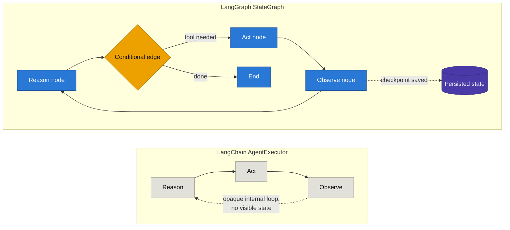
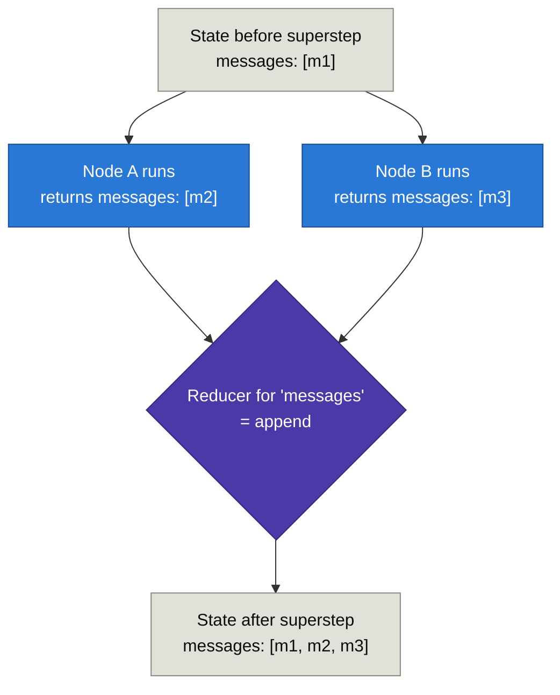
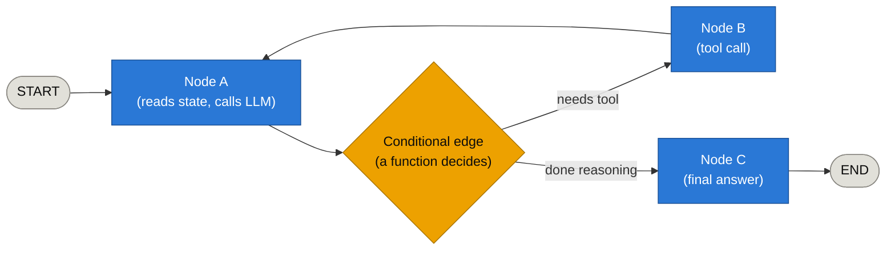
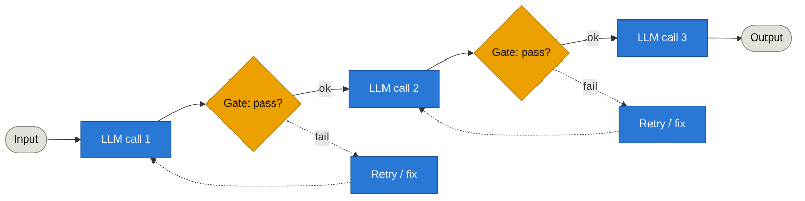
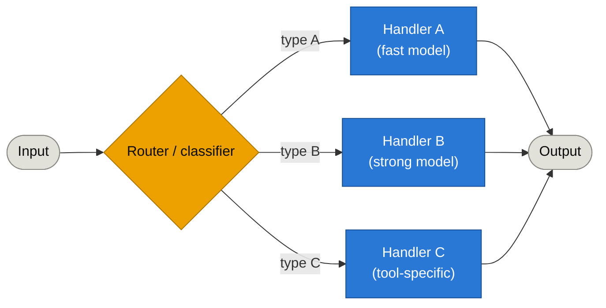
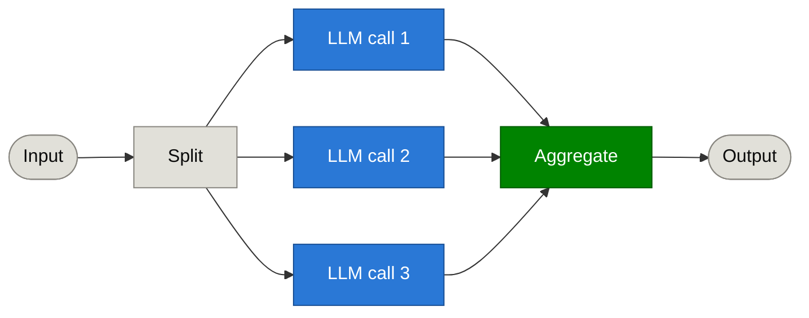
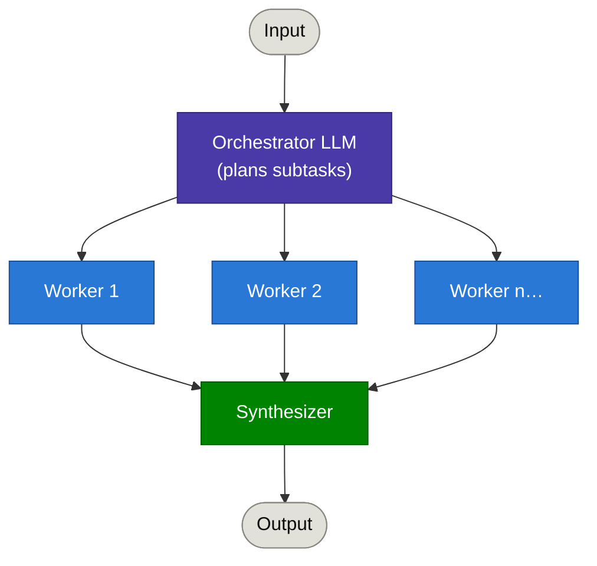
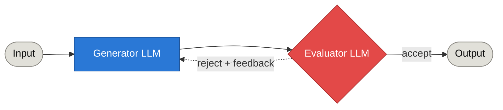

# LangGraph

*(As of mid-2026. LangChain's own* `AgentExecutor` *is now in maintenance mode — retiring Dec 2026 — with LangGraph as the recommended replacement for anything beyond a trivial chain.)*
---
Langraph is an orchestration framework for building intelligent, stateful and multi-step LLM workflows. It enables advanced features like parallelism, loops, branching, memory, and resumability - making it ideal for agentic and production-grade AI application

## Why LangGraph exists

LangChain's original abstraction — a **chain** — is a directed *acyclic* graph (DAG): step 1 feeds step 2 feeds step 3, no loops back. That's fine for a fixed pipeline, but an agent's core loop (reason → act → observe → reason again) is inherently **cyclic**. LangChain bolted this on with `AgentExecutor`, which works for simple cases but hits hard limits once the task gets non-trivial.

## Problems in LangChain's `AgentExecutor` → how LangGraph solves them

[https://www.youtube.com/watch?v=31qyMKNB2RA&list=PLKnIA16_RmvYsvB8qkUQuJmJNuiCUJFPL&index=4](https://www.youtube.com/watch?v=31qyMKNB2RA&list=PLKnIA16_RmvYsvB8qkUQuJmJNuiCUJFPL&index=4)

| Problem in `AgentExecutor`                                                                                 | LangGraph's fix                                                                                                                                            |
| ---------------------------------------------------------------------------------------------------------- | ---------------------------------------------------------------------------------------------------------------------------------------------------------- |
| **No cycles** — chains are DAGs; looping the reason→act→observe cycle is a hack, not a first-class concept | Models the agent as an explicit **graph with cycles** — nodes and edges, where an edge can point back to an earlier node                                   |
| **No persistent state across runs** — a crash or restart loses all intermediate progress                   | Built-in **checkpointing**: state is saved after every node, so a long-running job resumes from the last checkpoint instead of starting over               |
| **No pause/resume**                                                                                        | Native pause/resume via checkpoints — the graph can stop mid-execution and continue later, even after a process restart                                    |
| **No human-in-the-loop**                                                                                   | `interrupt_before` / `interrupt_after` on any node — pause for human approval, then resume with (optionally edited) state                                  |
| **No real conditional branching** — routing logic is hand-rolled control flow inside the executor          | **Conditional edges** are a first-class graph primitive — a 4-line if/else in `AgentExecutor` becomes one declared edge                                    |
| **No parallelism** — steps run strictly one after another                                                  | Supports **fan-out/fan-in**: multiple nodes run concurrently, then merge back into shared state                                                            |
| **Weak crash/error recovery** — one failed step could kill the whole run                                   | Per-node error handling: a `TimeoutPolicy` and typed `NodeError` handlers can route a failed node to a dedicated recovery node (Saga/compensation pattern) |
| **Poor observability** — hard to inspect what the agent was "thinking" mid-run                             | Every checkpoint is a full state snapshot → step-by-step inspection and **"time travel" debugging** (replay/fork from any past state)                      |
| **No clean multi-agent story** — composing agents-of-agents meant nested, opaque executors                 | A **subgraph is just a node** — supervisor/hierarchical multi-agent patterns compose naturally                                                             |

## The core shift: chain → graph

The left side is a black box: you can't see or control what happens between "Reason" and "Observe," and nothing survives a restart. The right side makes state, branching, and persistence explicit — every arrow and every decision point is something you actually declared.

## Core LangGraph Concepts, in Plain Language

### Graph
Think of a graph as a **flowchart of your program** instead of code that runs top-to-bottom. You draw boxes (steps) and arrows (what happens next), and LangGraph walks the flowchart for you. The whole thing is called a `StateGraph`.

### State
State is a **shared clipboard** that every step can read from and write to. You define its shape upfront (which fields exist — e.g. `messages`, `plan`, `retry_count`) and it gets passed from node to node as the graph runs. No node calls another node directly — they only ever interact through this shared clipboard.

### Nodes
A node is just **a function**. It receives the current state, does something (call an LLM, hit an API, run a calculation), and returns a dict describing what changed. That's it — a node doesn't know or care what ran before it or what runs after; it only reads state in and hands an update back out.

### Edges
An edge is the **arrow between two nodes** — "after node A finishes, go to node B." Two kinds:
- **Normal edge** — always goes to the same next node, no decision involved.
- **Conditional edge** — a function looks at the current state and decides which node to go to next (this is how routing, branching, and loops all get built — it's the same primitive doing all three jobs).

### Reducers
A reducer is the **rule for merging** a node's returned update into the existing state, for one specific field. The default rule (no reducer specified) is simple **overwrite** — the new value replaces the old one. But some fields shouldn't be overwritten — e.g. a running list of chat messages should **append**, not erase history. You declare that explicitly (e.g. `Annotated[list, add_messages]`), and from then on, every node that touches `messages` gets appended instead of clobbering. This matters most when multiple nodes write to the same field in parallel — without a reducer telling LangGraph how to combine them, whichever write happens to land last would silently win.

Without a reducer here, Node A's and Node B's updates would race — one would overwrite the other and you'd silently lose a message. The reducer is what makes "run things in parallel and safely combine the results" possible at all.

### Execution model: "supersteps" (borrowed from Google Pregel)

LangGraph doesn't execute node-by-node in a simple line — it runs in rounds called **supersteps**, based on the same message-passing model Google's Pregel system uses for large-scale graph processing:

1. At the start of a superstep, every node that has new incoming state "wakes up" and runs — if several nodes are ready at once, they run **in parallel**, all within the same superstep.
2. Each node returns its update; all updates get merged into shared state via their reducers.
3. Edges (including conditional ones) determine which nodes wake up for the *next* superstep.
4. This repeats until no node has anything left to do — that's when the graph reaches `END`.

This one mental model — supersteps + reducers — is what quietly gives you cycles (loop back to node A), branching (conditional edge), and parallel fan-out/fan-in (multiple nodes active in the same superstep) all from the same engine, instead of three separate features bolted on.

**Related concepts, briefly:**
- **Compiling** — you build the graph by describing nodes/edges, then call `.compile()` once before running it; this is what turns the description into an executable graph (and is where you attach a checkpointer).
- **Checkpointer** — the persistence layer that saves state after every superstep, which is what makes pause/resume and crash recovery (from the problem/fix table above) actually work.
- **`Send`** — how a node dynamically creates extra work for the *next* superstep (e.g. "spawn one worker per subtask I just decided on") — this is the primitive behind orchestrator-workers and parallelization above.

## Reliability in practice

Production surveys report `AgentExecutor` completing 78–85% of well-defined tasks, dropping to 55–70% once a task needs more than ~5 tool calls or any error recovery. LangGraph-based workflows report 88–95% completion on the same class of complex, multi-step tasks — the gap widens as task complexity grows, which tracks with the list above: most of what breaks `AgentExecutor` at scale (crash recovery, branching, retries) is exactly what LangGraph makes explicit.

## Current guidance (mid-2026)

- `AgentExecutor` is in maintenance mode, retiring **December 2026**.
- For new work: `create_react_agent()` for a prebuilt ReAct-style agent, or `StateGraph` directly for custom orchestration.
- Recent (Q2 2026) additions: per-node `TimeoutPolicy`, typed `NodeError` handlers with recovery-node routing, cooperative graceful shutdown, and a v2 typed streaming API (`StreamPart`).

---

## Common Agentic Workflow Patterns

Anthropic's "Building Effective Agents" splits agentic systems into **workflows** (you hard-code the path an LLM call takes) versus a fully autonomous **agent** (the LLM decides its own path — the cyclic `Reason → Act → Observe` graph shown above). Five workflow patterns cover most real use cases; each maps directly onto LangGraph primitives.
https://www.youtube.com/watch?v=D5KhiCDM9XQ&list=PLKnIA16_RmvYsvB8qkUQuJmJNuiCUJFPL&index=5

### 1. Prompt Chaining

Sequential LLM calls, each step's output feeding the next, with a validation gate between steps. Best when a task decomposes into a fixed sequence.

**In LangGraph:** a plain linear chain of nodes; each gate is a conditional edge that either continues forward or loops back to redo the previous node.

**Real-life example:** Marketing copy generation — one LLM call drafts the copy, a gate checks it against brand guidelines, then a second call translates it into another language, with a final gate verifying the translation kept the original meaning.

### 2. Routing

A classifier sends input to a specialized handler based on type — e.g., easy questions to a cheap/fast model, hard ones to a stronger one.

**In LangGraph:** one node returns a decision, followed by `add_conditional_edges` routing to whichever downstream node matches.

**Real-life example:** Customer support triage — billing questions route to a prompt with account/billing context, technical bugs route to a code-aware model with access to error logs, and general FAQs route to a small, fast model — so you're not paying flagship-model cost for "what are your hours."

### 3. Parallelization

Multiple LLM calls run at once, then get aggregated programmatically. Two variants: **sectioning** (independent subtasks in parallel) or **voting** (same task run N times, take consensus).

**In LangGraph:** the `Send` API fans out to run several nodes concurrently; their results merge back into shared state at the aggregating node (fan-out/fan-in).

**Real-life example:** Code review automation (*sectioning*) — one LLM call checks a PR diff for security issues, another checks style/lint conventions, a third checks for performance regressions, all in parallel, merged into one review comment. Or content moderation (*voting*) — run a flagged post through 3 independent moderation calls and flag it only if a majority agree it violates policy, reducing false positives.

### 4. Orchestrator-Workers

A central LLM dynamically decides *what* subtasks are needed (not fixed upfront, unlike parallelization) and delegates to worker LLMs, then synthesizes their results.

**In LangGraph:** the orchestrator node emits a dynamic list of `Send` calls (one per subtask it decides on at runtime) targeting a worker node or subgraph; a synthesizer node merges results. This is the pattern behind most multi-agent supervisor setups.

**Real-life example:** Deep-research report generation — an orchestrator reads the user's question, decides which sub-topics actually need investigating (not known in advance — depends on the question), spins up a worker per sub-topic to search and summarize, then synthesizes all worker outputs into one coherent report. This is the multi-agent pattern behind tools like Claude's own "Research" mode.

### 5. Evaluator-Optimizer

One LLM generates, a second evaluates and gives feedback, looping until the output passes.

**In LangGraph:** exactly the cyclic edge this whole doc is about — a conditional edge from the evaluator back to the generator. `AgentExecutor` can't express this loop cleanly; it's a single declared edge in `StateGraph`.

**Real-life example:** Literary translation — the generator produces a translation, the evaluator (prompted to focus on tone, idiom, and nuance rather than literal accuracy) critiques it, and the loop repeats with that feedback until the evaluator is satisfied. Same pattern works for code generation: generate → run tests → feed failures back to the generator → repeat until tests pass.

**Rule of thumb:** start with the simplest workflow pattern that solves the problem; only reach for full agent autonomy (the `Reason → Act → Observe` graph above) when the task genuinely can't be decomposed ahead of time.

---

## Sources & References

- [LangChain vs LangGraph — Visual Comparison Guide (2026)](https://myengineeringpath.dev/tools/langchain-vs-langgraph/)
- [From LangChain to LangGraph: When Agents Need State Machines](https://www.abstractalgorithms.dev/from-langchain-to-langgraph-when-agents-need-state-machines)
- [LangChain vs LangGraph: Complete Comparison 2026](https://www.digitalapplied.com/blog/langchain-vs-langgraph-comparison-2026)
- [LangGraph vs LangChain: Which to Use for Production AI Agents in 2026 — Spheron](https://www.spheron.network/blog/langgraph-vs-langchain/)
- [Choosing an agent framework: LangChain vs LangGraph vs CrewAI vs PydanticAI vs Mastra vs Vercel AI SDK — Speakeasy](https://www.speakeasy.com/blog/ai-agent-framework-comparison)

### Workflow Patterns
- [Building Effective AI Agents — Anthropic](https://www.anthropic.com/engineering/building-effective-agents)
- [Anthropic's Effective Agents Framework: A Pattern Map — AgentPatterns.ai](https://www.agentpatterns.ai/agent-design/anthropic-effective-agents-framework/)

### Core Concepts (Graph, State, Reducers, Supersteps)
- [Graph API overview — Docs by LangChain](https://docs.langchain.com/oss/python/langgraph/graph-api)
- [LangGraph Nodes, Edges & State: Core Concepts Explained — machinelearningplus](https://machinelearningplus.com/gen-ai/langgraph-graph-concepts-nodes-edges-state/)
- [Learning LangGraph the Right Way: Why State, Reducers, and Super-steps Are the Real Core](https://medium.com/@yhocotw31016/learning-langgraph-the-right-way-why-state-reducers-and-super-steps-are-the-real-core-af84490ea6d3)
- [LangGraph Transactions — Pregel, Message Passing and Super-steps](https://medium.com/@maksymilian.pilzys/langgraph-transactions-pregel-message-passing-and-super-steps-0e101e620f10)

