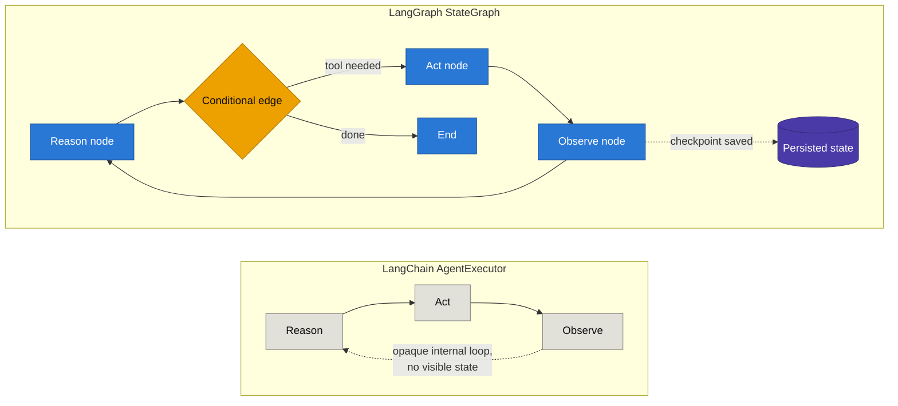

# LangGraph

*(As of mid-2026. LangChain's own* `AgentExecutor` *is now in maintenance mode — retiring Dec 2026 — with LangGraph as the recommended replacement for anything beyond a trivial chain.)*

---

## Why LangGraph exists

LangChain's original abstraction — a **chain** — is a directed *acyclic* graph (DAG): step 1 feeds step 2 feeds step 3, no loops back. That's fine for a fixed pipeline, but an agent's core loop (reason → act → observe → reason again) is inherently **cyclic**. LangChain bolted this on with `AgentExecutor`, which works for simple cases but hits hard limits once the task gets non-trivial.

## Problems in LangChain's `AgentExecutor` → how LangGraph solves them

[https://www.youtube.com/watch?v=31qyMKNB2RA&list=PLKnIA16_RmvYsvB8qkUQuJmJNuiCUJFPL&index=4](https://www.youtube.com/watch?v=31qyMKNB2RA&list=PLKnIA16_RmvYsvB8qkUQuJmJNuiCUJFPL&index=4)

| Problem in `AgentExecutor`                                                                                 | LangGraph's fix                                                                                                                                            |
| ---------------------------------------------------------------------------------------------------------- | ---------------------------------------------------------------------------------------------------------------------------------------------------------- |
| **No cycles** — chains are DAGs; looping the reason→act→observe cycle is a hack, not a first-class concept | Models the agent as an explicit **graph with cycles** — nodes and edges, where an edge can point back to an earlier node                                   |
| **No persistent state across runs** — a crash or restart loses all intermediate progress                   | Built-in **checkpointing**: state is saved after every node, so a long-running job resumes from the last checkpoint instead of starting over               |
| **No pause/resume**                                                                                        | Native pause/resume via checkpoints — the graph can stop mid-execution and continue later, even after a process restart                                    |
| **No human-in-the-loop**                                                                                   | `interrupt_before` / `interrupt_after` on any node — pause for human approval, then resume with (optionally edited) state                                  |
| **No real conditional branching** — routing logic is hand-rolled control flow inside the executor          | **Conditional edges** are a first-class graph primitive — a 4-line if/else in `AgentExecutor` becomes one declared edge                                    |
| **No parallelism** — steps run strictly one after another                                                  | Supports **fan-out/fan-in**: multiple nodes run concurrently, then merge back into shared state                                                            |
| **Weak crash/error recovery** — one failed step could kill the whole run                                   | Per-node error handling: a `TimeoutPolicy` and typed `NodeError` handlers can route a failed node to a dedicated recovery node (Saga/compensation pattern) |
| **Poor observability** — hard to inspect what the agent was "thinking" mid-run                             | Every checkpoint is a full state snapshot → step-by-step inspection and **"time travel" debugging** (replay/fork from any past state)                      |
| **No clean multi-agent story** — composing agents-of-agents meant nested, opaque executors                 | A **subgraph is just a node** — supervisor/hierarchical multi-agent patterns compose naturally                                                             |

## The core shift: chain → graph

The left side is a black box: you can't see or control what happens between "Reason" and "Observe," and nothing survives a restart. The right side makes state, branching, and persistence explicit — every arrow and every decision point is something you actually declared.

## Reliability in practice

Production surveys report `AgentExecutor` completing 78–85% of well-defined tasks, dropping to 55–70% once a task needs more than ~5 tool calls or any error recovery. LangGraph-based workflows report 88–95% completion on the same class of complex, multi-step tasks — the gap widens as task complexity grows, which tracks with the list above: most of what breaks `AgentExecutor` at scale (crash recovery, branching, retries) is exactly what LangGraph makes explicit.

## Current guidance (mid-2026)

- `AgentExecutor` is in maintenance mode, retiring **December 2026**.
- For new work: `create_react_agent()` for a prebuilt ReAct-style agent, or `StateGraph` directly for custom orchestration.
- Recent (Q2 2026) additions: per-node `TimeoutPolicy`, typed `NodeError` handlers with recovery-node routing, cooperative graceful shutdown, and a v2 typed streaming API (`StreamPart`).

---

## Sources & References

- [LangChain vs LangGraph — Visual Comparison Guide (2026)](https://myengineeringpath.dev/tools/langchain-vs-langgraph/)
- [From LangChain to LangGraph: When Agents Need State Machines](https://www.abstractalgorithms.dev/from-langchain-to-langgraph-when-agents-need-state-machines)
- [LangChain vs LangGraph: Complete Comparison 2026](https://www.digitalapplied.com/blog/langchain-vs-langgraph-comparison-2026)
- [LangGraph vs LangChain: Which to Use for Production AI Agents in 2026 — Spheron](https://www.spheron.network/blog/langgraph-vs-langchain/)
- [Choosing an agent framework: LangChain vs LangGraph vs CrewAI vs PydanticAI vs Mastra vs Vercel AI SDK — Speakeasy](https://www.speakeasy.com/blog/ai-agent-framework-comparison)

