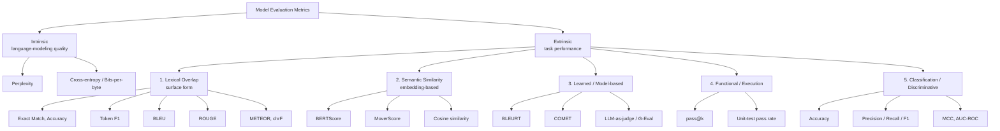
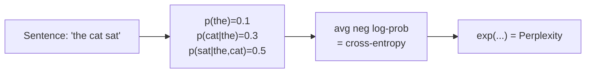
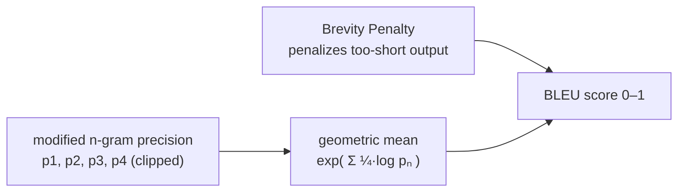
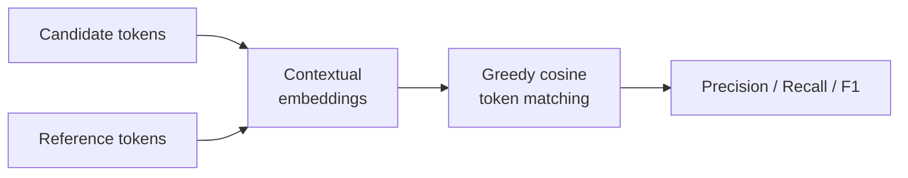
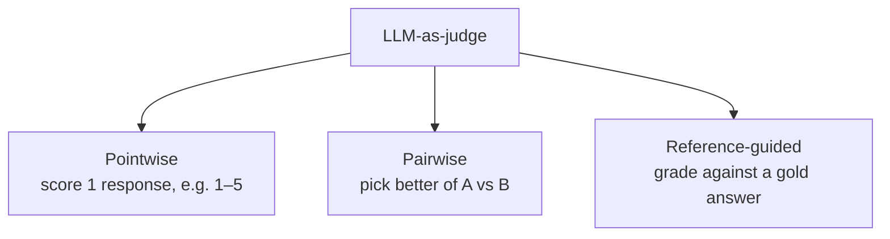
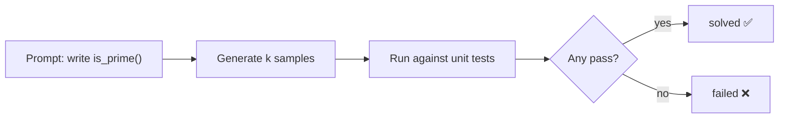
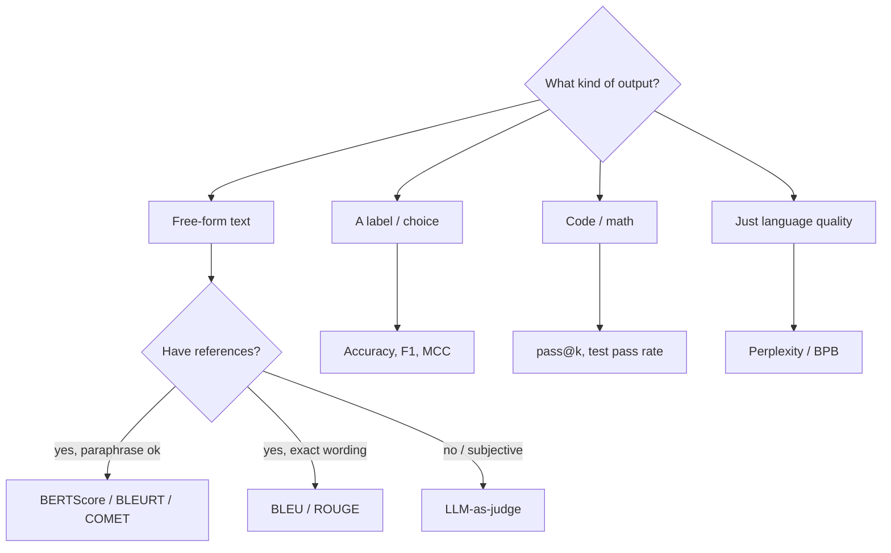

# Model Evaluation Metrics — A Complete Taxonomy

> **Scope:** This document covers **model evaluation** only — measuring the raw
> capabilities of an LLM itself, not a full application (RAG / agent / prompt
> pipeline). System evaluation is a separate topic.

---

## 1. The Big Picture

At the top level, model-eval metrics answer one of two questions:

- **How well does the model model language?** → *intrinsic* metrics (no task, no reference answer).
- **How well does the model do a task?** → *extrinsic* metrics (needs a task, usually a reference answer).

Extrinsic metrics then differ by **how they compare** the model's output to what "correct" looks like.



**Quick orientation table:**

| Category | Needs a reference? | Captures meaning? | Cost | Typical use |
|---|---|---|---|---|
| Intrinsic | No | — | Cheap | Pretraining, comparing base models |
| Lexical overlap | Yes | ❌ surface only | Cheap | Translation, summarization, short QA |
| Semantic similarity | Yes | ✅ | Medium | Paraphrase-tolerant generation |
| Learned / model-based | Sometimes | ✅✅ | Medium–High | Open-ended quality, MT |
| Functional / execution | No (uses tests) | ✅ (by outcome) | Medium | Code, math, tool use |
| Classification | Yes (label) | ❌ (label match) | Cheap | Multiple-choice, sentiment |

---

## 2. Intrinsic Metrics — *how well does it model language?*

These measure the model's raw ability to predict text. **No task and no gold answer** — just: how surprised is the model by real text? Lower = better.

### Perplexity (PPL)

The single most important intrinsic metric. Intuitively: *"on average, how many words is the model choosing between at each step?"* A perplexity of 10 means the model is as uncertain as if it were picking uniformly among 10 words.

```
                 ( -1                              )
PPL(W) = exp     ( ---  * Σ  log p(w_i | w_<i)      )
                 (  N     i=1..N                    )

  = exp( average negative log-probability per token )
```



| PPL value | Interpretation |
|---|---|
| ~1 | Perfect — model is certain of every next token |
| Low (e.g. 10–20) | Strong language model |
| High (e.g. 100+) | Weak / mismatched to the text domain |

**Caveats:**
- Only comparable across models using the **same tokenizer / vocabulary**.
- Measures fluency, **not correctness or usefulness** — a confident liar has low perplexity.

### Cross-entropy & Bits-per-Byte (BPB)

Perplexity is just the exponential of **cross-entropy loss** (the training loss itself). **Bits-per-byte** normalizes by raw bytes instead of tokens, making it *tokenizer-independent* — the fairer way to compare models with different vocabularies.

```
PPL = e^(cross-entropy)              BPB = cross-entropy (bits) / bytes
```

---

## 3. Lexical Overlap Metrics — *surface-form matching*

Reference-based. Compare the output's **words / n-grams** to a gold answer. Fast and cheap, but **blind to paraphrase** ("big" ≠ "large").

### 3a. Exact Match (EM) & Accuracy

Strictest possible: output must equal the reference exactly (after normalization). Binary per example.

| Reference | Prediction | EM |
|---|---|---|
| `Paris` | `Paris` | ✅ 1 |
| `Paris` | `paris.` | ✅ 1 *(after lowercase + strip punct)* |
| `Paris` | `The capital is Paris` | ❌ 0 |

Great for short-answer QA and multiple-choice; useless for long generation.

### 3b. Token-level F1

Softer than EM — reward **partial** overlap of tokens. Treats prediction and reference as bags of tokens.

```
              shared tokens                    shared tokens                2 * P * R
Precision =  ----------------      Recall =   ----------------      F1 =   -----------
             tokens in pred                   tokens in ref                  P + R
```

> **Example** — Reference: `the cat sat`, Prediction: `the cat`
> shared = {the, cat} = 2 → P = 2/2 = 1.0, R = 2/3 = 0.67 → **F1 = 0.80**

Standard in SQuAD-style extractive QA.

### 3c. BLEU (translation)

The BLEU (Bilingual Evaluation Understudy) score is an automated metric that measures the similarity between LLM-generated text and a reference text (ground truth) by counting matching n-grams (sequences of words). Scores range from 0 to 1, with higher scores indicating closer matches to human reference text. 
The BLEU score is primarily precision-driven, focusing on how many words and phrases in the model’s output also appear in the human-written reference
* n-gram Precision: It calculates the proportion of matching n-grams (unigrams, bigrams, etc.) between the candidate and reference text.
* Brevity Penalty (BP): BLEU includes a multiplier that heavily penalizes the model for generating overly short responses, preventing the model from achieving artificially high precision by omitting information

```
BLEU = BP × exp( Σ  w_n · log p_n )      (n = 1..4,  w_n = 1/4 each)
                n
```



**The four pieces:**

**1. Modified (clipped) n-gram precision.** Plain precision =
(matching n-grams) / (n-grams in candidate). The *modification* is **clipping**:
each n-gram counts only up to the number of times it appears in the reference —
this kills the `the the the the` exploit.

**2. Brevity Penalty (BP).** Precision alone rewards *short* output (one perfect
word), so BP penalizes candidates shorter than the reference. There is no
"too long" penalty — length is punished indirectly by diluting precision.

```
BP = 1                if c > r      (candidate long enough)
BP = exp(1 - r/c)     if c <= r     (too short -> penalty < 1)

  c = candidate length,   r = reference length
```

**3. Geometric mean.** BLEU multiplies the four precisions. Because it is a
*product*, **if any single pₙ is 0, BLEU is 0** → short texts need *smoothing*.

**Worked example:**

```
Reference:  the cat is on the mat      (r = 6 words)
Candidate:  the cat is on mat          (c = 5 words)
```

| n | Candidate n-grams | Matches (clipped) | pₙ |
|---|---|---|---|
| 1 | the, cat, is, on, mat | 5 / 5 | **1.000** |
| 2 | the·cat, cat·is, is·on, on·mat | 3 / 4 *(on·mat ✗)* | **0.750** |
| 3 | the·cat·is, cat·is·on, is·on·mat | 2 / 3 | **0.667** |
| 4 | the·cat·is·on, cat·is·on·mat | 1 / 2 | **0.500** |

```
Geometric mean = exp( ¼(ln1.0 + ln0.75 + ln0.667 + ln0.5) )
               = exp( ¼ × (-1.386) ) = exp(-0.347) = 0.707

Brevity penalty (c=5 <= r=6):
  BP = exp(1 - 6/5) = exp(-0.2) = 0.819

BLEU = 0.819 × 0.707 = 0.58     (≈ 58 on the 0–100 scale)
```

**Critical gotchas:**

| Issue | Why it bites |
|---|---|
| **Corpus- vs sentence-level** | Designed to aggregate over a whole test set; sentence-level BLEU is noisy and needs smoothing. |
| **Tokenization-sensitive** | Different tokenizers → different scores for the *same* translation. Use **sacreBLEU** for reproducible numbers. |
| **Multiple references** | Clipping takes the max count across references; more references → fairer scores. |
| **No synonyms / no meaning** | "big" vs "large" scores as a miss — BLEU's fundamental blind spot (METEOR/BERTScore fix it). |
| **Zero-precision cliff** | One missing n-gram order zeroes the whole score without smoothing. |

- Corpus-level, order-sensitive. Range 0–1 (often ×100).
- Weak for anything but translation; penalizes valid rewordings.

### 3d. ROUGE (summarization)

**Recall-oriented** — did the summary *capture* the reference's content? Common variants:

| Variant | Measures |
|---|---|
| **ROUGE-N** | n-gram overlap (ROUGE-1 = unigrams, ROUGE-2 = bigrams) |
| **ROUGE-L** | Longest Common Subsequence — rewards in-order overlap without needing contiguity |

> **Example** — Reference: `the cat sat on the mat`, Summary: `the cat sat on mat`
> ROUGE-1 recall ≈ overlapping unigrams / reference unigrams → high (~0.83).

### 3e. METEOR & chrF (refinements)

- **METEOR** — like BLEU but adds **stemming + synonym matching** (via WordNet) and word-order penalty → correlates better with humans than raw BLEU.
- **chrF** — F-score over **character** n-grams instead of words → robust to morphology and typos, strong for many languages.

**Category summary:**

| Metric | Orientation | Best for | Sees meaning? |
|---|---|---|---|
| Exact Match | exact | Short QA, MCQ | ❌ |
| Token F1 | balanced | Extractive QA | ❌ |
| BLEU | precision | Translation | ❌ |
| ROUGE | recall | Summarization | ❌ |
| METEOR | balanced+synonyms | Translation | ⚠️ partial |
| chrF | char-level | Morphological langs | ❌ |

---

## 4. Semantic Similarity Metrics — *embedding-based*

Fix the core weakness of lexical metrics: they compare **meaning via embeddings**, so paraphrases score high. Reference-based.

### BERTScore

Embed every token of candidate and reference with BERT, then greedily match tokens by **cosine similarity** and compute P / R / F1 over those soft matches.



> `The film was fantastic` vs reference `The movie was great`
> BLEU ≈ low (only "The"/"was" overlap), **BERTScore ≈ high** (fantastic≈great, film≈movie).

### MoverScore & Cosine Similarity

- **MoverScore** — uses Word Mover's Distance (optimal transport) over embeddings; a "soft" many-to-many version of BERTScore.
- **Sentence-embedding cosine** — embed the whole sentence (e.g. Sentence-BERT) and take cosine similarity. Simple, fast, good for semantic-equivalence checks.

| Metric | Granularity | Strength |
|---|---|---|
| BERTScore | token | Balances precision/recall, widely used |
| MoverScore | token (transport) | Handles many-to-many alignment |
| Cosine (SBERT) | sentence | Cheapest semantic check |

---

## 5. Learned / Model-based Metrics — *a trained model does the scoring*

Instead of a formula, a **model trained on human judgments** (or a powerful LLM) predicts quality. Best correlation with humans; higher cost and less transparency.

| Metric | How it works | Notes |
|---|---|---|
| **BLEURT** | BERT fine-tuned on human ratings of Machine Transalation | Regression to a human score |
| **COMET** | Trained on human MT rankings, uses source+hypothesis+reference | SOTA for translation eval |
| **GPTScore** | Reads the LLM's **token log-probabilities** for the candidate under a quality instruction | Implicit score, reference-free possible |
| **G-Eval** | LLM-as-judge **+ chain-of-thought + probability-weighted** scores | Sits between GPTScore and judge |
| **LLM-as-judge** | Prompt the LLM to **output a verdict** (rating or A-vs-B) | Dominant for open-ended tasks |

### GPTScore vs. LLM-as-judge

Both use an LLM to evaluate text — the difference is **how the score is extracted**.

| | **GPTScore** | **LLM-as-judge** |
|---|---|---|
| **Score comes from** | The model's **token probabilities** (how *likely* it finds a good text) | The **text the model writes back** (a rating or preference) |
| **Mechanism** | Conditional generation probability — perplexity conditioned on a quality instruction | Prompted reasoning / rating |
| **Needs logprob access?** | Yes | No — works with any chat API |
| **Score type** | Implicit (read under the hood) | Explicit (stated verdict) |
| **Status** | Research-era; cheap, reference-free | Dominant today; handles pairwise + can explain itself |

- **GPTScore's insight:** a good text is one a strong LLM finds *unsurprising* to
  generate given a prompt describing the quality you want. It never asks
  "rate this 1–5" — it reads the average log-probability directly.
- **LLM-as-judge:** you literally prompt *"rate this 1–5"* or *"which is better, A or B?"*
  and parse the answer.
- **G-Eval** is a *judge* method that borrows GPTScore's trick — it prompts for a
  score but weights it by the token probabilities of each rating.

```
LLM-based evaluation
├── GPTScore      → score = f(token log-probabilities)   [implicit]
├── LLM-as-judge  → score = the model's written verdict  [explicit]
│     ├── pointwise  (rate one, 1–5)
│     ├── pairwise   (A vs B)
│     └── ref-guided (grade against gold)
└── G-Eval        → judge + chain-of-thought + probability-weighted scores
```

### LLM-as-judge modes



**Judge biases to control for:**

| Bias | Symptom | Mitigation |
|---|---|---|
| Position bias | Prefers whichever answer is first | Swap order, average both |
| Verbosity bias | Prefers longer answers | Length-controlled prompts |
| Self-preference | Model favors its own outputs | Use a different judge family |

---

## 6. Functional / Execution-based Metrics — *does it actually work?*

For **code and math**, don't compare text — **run it**. Correctness = passes the tests. This is the gold standard where an objective outcome exists.

### pass@k (code generation)

Generate *k* samples; the problem counts as solved if **any** sample passes all unit tests. Estimated unbiasedly from *n ≥ k* samples with *c* correct:

```
                        C(n - c, k)
pass@k  =  E [ 1  -  ----------------- ]
                          C(n, k)

  n = total samples generated,  c = number that pass,  k = attempts allowed
  C(a, b) = "a choose b"
```



| Metric | Meaning |
|---|---|
| pass@1 | Solved on the first try (most realistic for users) |
| pass@10 / pass@100 | Solved within 10 / 100 attempts (measures coverage) |

Used by **HumanEval, MBPP**. The math analogue: check the final numeric answer (GSM8K, MATH).

---

## 7. Classification / Discriminative Metrics — *closed-ended tasks*

For multiple-choice (MMLU), sentiment, NLI, etc., where output maps to a **label**. Borrowed straight from classic ML.

Given the confusion matrix:

|  | Predicted + | Predicted − |
|---|---|---|
| **Actual +** | TP | FN |
| **Actual −** | FP | TN |

| Metric | Formula | When it matters |
|---|---|---|
| **Accuracy** | (TP+TN)/all | Balanced classes |
| **Precision** | TP/(TP+FP) | False positives costly |
| **Recall** | TP/(TP+FN) | False negatives costly |
| **F1** | 2PR/(P+R) | Imbalanced classes |
| **MCC** | correlation of pred vs actual | Robust single number for imbalance |
| **AUC-ROC** | area under TPR-vs-FPR curve | Ranking / threshold-free quality |

> For multiple-choice benchmarks, "accuracy" often means: does the highest-probability
> option letter (A/B/C/D) match the key — a blend of classification + likelihood scoring.

---

## 8. Use Cases & Limitations (per metric)

The single most important reference: **what each metric is good for in LLM
evaluation, and where it breaks.** Grouped by category.

### Intrinsic

| Metric | Use cases in LLMs | Limitations |
|---|---|---|
| **Perplexity** | Track pretraining/fine-tuning progress; compare base models on a held-out corpus; detect domain shift; quick smoke-test of a language model. | Only comparable across models with the **same tokenizer**; measures fluency **not correctness** (a confident hallucination scores well); says nothing about instruction-following or usefulness. |
| **Cross-entropy / BPB** | Report the training loss; **tokenizer-independent** cross-model comparison (BPB); scaling-law studies. | Same blind spot as perplexity — pure language-modeling signal, no task quality; abstract, hard to interpret for stakeholders. |

### Lexical Overlap

| Metric | Use cases in LLMs | Limitations |
|---|---|---|
| **Exact Match** | Short-answer QA, multiple-choice, closed-form factual answers, structured-output validation (JSON keys, math final answer). | Brutally strict — any paraphrase, extra word, or formatting diff = 0; useless for open-ended generation. |
| **Token F1** | Extractive QA (SQuAD), span extraction, entity/keyword coverage where partial credit matters. | Bag-of-tokens → ignores word order and meaning; rewards keyword stuffing; still blind to synonyms. |
| **BLEU** | Machine translation, corpus-level benchmarking, cheap regression checks in generation pipelines. | No synonyms/meaning; tokenization-sensitive (use sacreBLEU); noisy at sentence level; zero-precision cliff; poor human correlation off-translation. |
| **ROUGE** | Summarization (content coverage), headline/caption overlap, recall-focused generation. | Recall bias favors long outputs; rewards copying; surface-only, misses abstractive paraphrase and factual errors. |
| **METEOR** | Translation/captioning where synonym + stem matching improves human correlation over BLEU. | Needs WordNet/language resources (English-centric); slower; still largely surface-level. |
| **chrF** | Morphologically rich languages, MT, robustness to typos/spelling. | Character-level → less interpretable; still no semantics. |

### Semantic Similarity

| Metric | Use cases in LLMs | Limitations |
|---|---|---|
| **BERTScore** | Paraphrase-tolerant scoring of summaries/translations/answers; semantic regression tests where wording varies. | Needs a good embedding model; cost > lexical; can rate fluent-but-wrong text as similar; **misses factual/logical errors**; embedding-model bias. |
| **MoverScore** | Same as BERTScore when many-to-many token alignment matters. | Slower (optimal transport); same semantic-but-not-factual blind spot. |
| **Cosine (SBERT)** | Fast semantic-equivalence checks, dedup, clustering, retrieval-style similarity. | Whole-sentence embedding loses fine detail; a high score ≠ factually correct; threshold choice is arbitrary. |

### Learned / Model-based

| Metric | Use cases in LLMs | Limitations |
|---|---|---|
| **BLEURT** | Translation/generation quality with better human correlation than BLEU. | Trained on specific human-rating data → domain/language bias; a black box; needs the model at inference. |
| **COMET** | State-of-the-art MT evaluation using source + hypothesis (+ reference). | MT-specialized; needs source text; opaque; retraining to move domains. |
| **G-Eval / GPTScore / LLM-as-judge** | Open-ended quality (chat, summarization, creativity); rubric scoring; pairwise model comparison; reference-free eval. | **Costly & non-deterministic**; position / verbosity / self-preference **biases**; can be gamed; judge may hallucinate; needs bias-mitigation (order swaps, different judge family). |

### Functional / Execution

| Metric | Use cases in LLMs | Limitations |
|---|---|---|
| **pass@k / test pass rate** | Code generation (HumanEval, MBPP), math final-answer checking (GSM8K), tool/function-call correctness, agent task success. | Needs executable tests + a sandbox; only as good as test coverage (passing ≠ correct); binary, ignores partial credit and code quality/style. |

### Classification / Discriminative

| Metric | Use cases in LLMs | Limitations |
|---|---|---|
| **Accuracy** | Multiple-choice benchmarks (MMLU), balanced classification, sentiment. | Misleading on imbalanced classes; ignores confidence/calibration; sensitive to answer-parsing. |
| **Precision / Recall / F1** | Imbalanced tasks; toxicity/safety detection; where FP vs FN costs differ. | Requires a threshold; per-class; doesn't capture ranking quality. |
| **MCC** | Single robust score for imbalanced binary classification. | Binary-focused; less intuitive to non-experts. |
| **AUC-ROC** | Threshold-free ranking quality, safety classifiers, calibration studies. | Needs probability scores (not just labels); can look optimistic under heavy imbalance (prefer PR-AUC). |

---

## 9. Choosing a Metric



**Rules of thumb:**
- Never rely on a single metric — pair a cheap lexical/label metric with a semantic or judge-based one.
- Report **what the metric is blind to** (BLEU → paraphrase; perplexity → correctness; accuracy → calibration).
- For anything open-ended, **validate that your automated metric correlates with human preference** before trusting it at scale.

---

## 10. References & Sources

### Original papers (the metric definitions)

| Metric | Paper | Link |
|---|---|---|
| Perplexity | Jurafsky & Martin, *Speech and Language Processing* (ch. 3) | https://web.stanford.edu/~jurafsky/slp3/ |
| BLEU | Papineni et al., 2002 | https://aclanthology.org/P02-1040/ |
| sacreBLEU | Post, 2018 (reproducible BLEU) | https://arxiv.org/abs/1804.08771 |
| ROUGE | Lin, 2004 | https://aclanthology.org/W04-1013/ |
| METEOR | Banerjee & Lavie, 2005 | https://aclanthology.org/W05-0909/ |
| chrF | Popović, 2015 | https://aclanthology.org/W15-3049/ |
| BERTScore | Zhang et al., 2019 | https://arxiv.org/abs/1904.09675 |
| MoverScore | Zhao et al., 2019 | https://arxiv.org/abs/1909.02622 |
| BLEURT | Sellam et al., 2020 | https://arxiv.org/abs/2004.04696 |
| COMET | Rei et al., 2020 | https://arxiv.org/abs/2009.09025 |
| GPTScore | Fu et al., 2023 | https://arxiv.org/abs/2302.04166 |
| G-Eval | Liu et al., 2023 | https://arxiv.org/abs/2303.16634 |
| LLM-as-judge / MT-Bench / Chatbot Arena | Zheng et al., 2023 | https://arxiv.org/abs/2306.05685 |
| pass@k / HumanEval | Chen et al., 2021 | https://arxiv.org/abs/2107.03374 |
| MBPP | Austin et al., 2021 | https://arxiv.org/abs/2108.07732 |

### Benchmark datasets

| Benchmark | Tests | Link |
|---|---|---|
| MMLU | Knowledge / reasoning (57 subjects) | https://arxiv.org/abs/2009.03300 |
| GSM8K | Grade-school math | https://arxiv.org/abs/2110.14168 |
| MATH | Competition math | https://arxiv.org/abs/2103.03874 |
| HellaSwag | Commonsense NLI | https://arxiv.org/abs/1905.07830 |
| TruthfulQA | Truthfulness / misconceptions | https://arxiv.org/abs/2109.07958 |

### Eval frameworks & tools

| Tool | What it does | Link |
|---|---|---|
| **LM Evaluation Harness** (EleutherAI) | De-facto standard for benchmark runs (MMLU, GSM8K, …) | https://github.com/EleutherAI/lm-evaluation-harness |
| **HELM** (Stanford CRFM) | Holistic, multi-metric evaluation suite | https://crfm.stanford.edu/helm/ |
| **OpenAI Evals** | Framework for writing custom evals | https://github.com/openai/evals |
| **DeepEval** | Pytest-style LLM eval (G-Eval, RAG metrics) | https://github.com/confident-ai/deepeval |
| **promptfoo** | Config-driven eval + red-teaming | https://github.com/promptfoo/promptfoo |
| **Hugging Face `evaluate`** | Library implementing BLEU/ROUGE/BERTScore/etc. | https://github.com/huggingface/evaluate |

---

## 11. Leaderboards & Live Dashboards

Where to see how famous models actually rank.

| Dashboard | Focus | Link |
|---|---|---|
| **Arena** (formerly LMArena / LMSYS Chatbot Arena) | Human-preference Elo from live head-to-head votes — the most-watched board | https://lmarena.ai/leaderboard |
| **Open LLM Leaderboard** (Hugging Face) | Automated academic benchmarks. **Archived (2024–2025) — static snapshot**, no new models | https://huggingface.co/spaces/open-llm-leaderboard/open_llm_leaderboard |
| **Stanford HELM** | Multi-scenario, multi-metric holistic rankings | https://crfm.stanford.edu/helm/ |
| **Artificial Analysis** | Quality **+ speed + price** trade-offs across providers | https://artificialanalysis.ai/ |
| **LiveBench** | Contamination-resistant, monthly-refreshed questions | https://livebench.ai/ |
| **Aider LLM Leaderboards** | Real-world **code-editing** performance | https://aider.chat/docs/leaderboards/ |
| **SWE-bench** | Resolving real GitHub issues (agentic coding) | https://www.swebench.com/ |
| **Scale SEAL** | Private, contamination-free expert evals | https://scale.com/leaderboard |

> **Note:** LMArena officially rebranded to **"Arena"** in Jan 2026, but "Chatbot
> Arena" remains the common name. It uses a **Bradley-Terry (Elo-style)** rating
> from millions of pairwise human votes — i.e. large-scale *LLM-as-judge by humans*.

> **Pick by purpose:** human-preference feel → **Arena**; reproducible academic
> scores → **HELM / LM-Eval-Harness**; production cost/latency → **Artificial
> Analysis**; coding → **Aider / SWE-bench**; leakage-resistant → **LiveBench / SEAL**.

---

## Appendix: One-line cheat sheet

| Metric | Category | One-liner |
|---|---|---|
| Perplexity | Intrinsic | Average branching factor of next-token prediction |
| Exact Match | Lexical | Output must equal reference exactly |
| Token F1 | Lexical | Overlap of tokens, precision+recall |
| BLEU | Lexical | Clipped n-gram precision + brevity penalty (MT) |
| ROUGE | Lexical | n-gram / LCS recall (summarization) |
| METEOR | Lexical | BLEU + stemming + synonyms |
| chrF | Lexical | Character-n-gram F-score |
| BERTScore | Semantic | Token cosine matching via embeddings |
| MoverScore | Semantic | Optimal-transport embedding distance |
| BLEURT | Learned | BERT fine-tuned on human MT ratings |
| COMET | Learned | Learned MT metric using source+ref |
| G-Eval / LLM-judge | Learned | Strong LLM scores on a rubric |
| pass@k | Functional | Any of k code samples passes tests |
| Accuracy/F1/MCC | Classification | Label-match quality |
